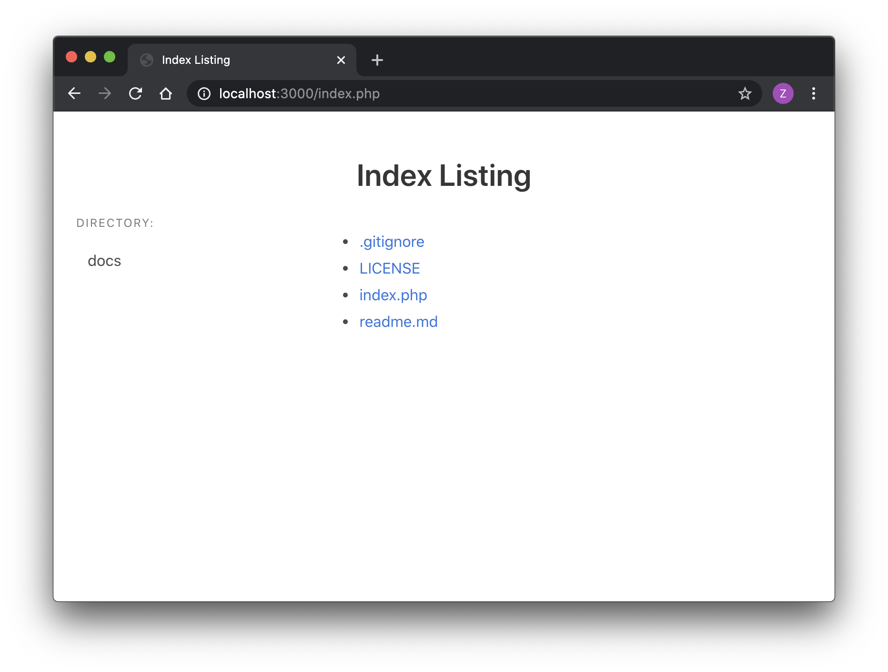
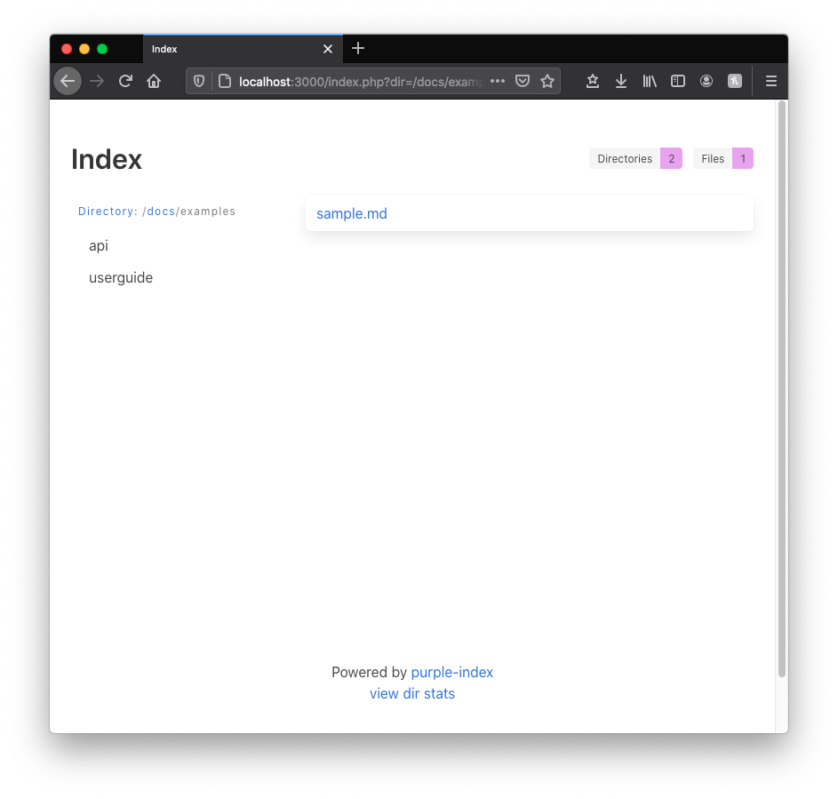

A simple php to browse a DocumentRoot directory where it list all dirs and files.

SECURITY WARNING:
Exposing directory and files is consider security risk for publicly hosted server! This
script is only intended for internal web site and serve as tool.

Project Owner: Zemian Deng

Project Home: https://github.com/zemian/purple-index

License: The MIT License (MIT)

Release Notes: _See `index.php` source comment_

Live Demo: [purple-index](https://zemiancodeplayground.000webhostapp.com/purple-index/index.php)

To try it, run this:

	php -S localhost:3000
	open http://localhost:3000

Why called `purple-index`? I want an adjective starts with `P` that stands for `PHP`, so Purple Index is
just as good as any.

Screenshots:

## Related Projects

* Want to take Markdown Notes with just a single `index.php`? Try [MarkNotes](https://github.com/zemian/marknotes)
